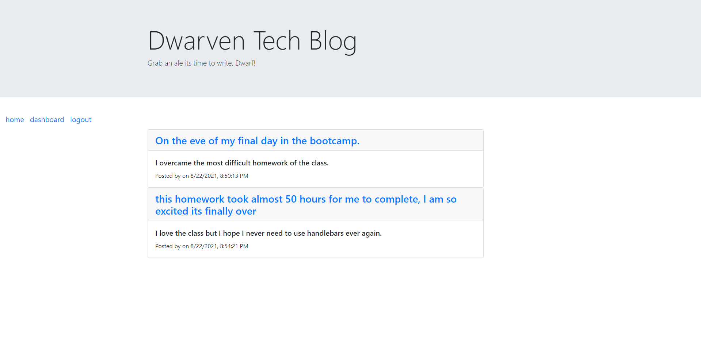
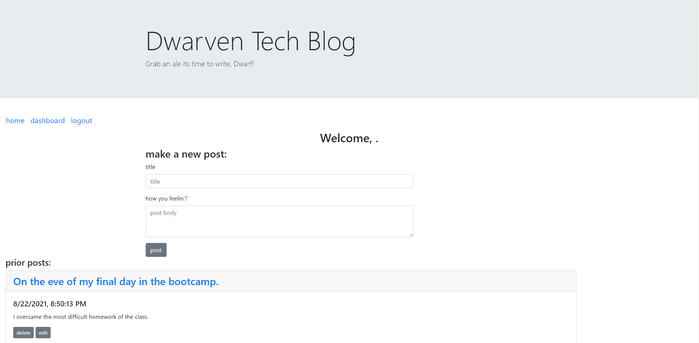

# Dwarven Tech Blog

[]
  
# Description

   This application is a blog site, create, edit or delete a blog post. Create as many as you would like! Sign up or log in edit a post!

   Deployable: https://aqueous-sea-56644.herokuapp.com/

   
   

    
# Table of Contents

* [Execute](#Execute)
    
* [Usage](#usage)

* [License](#license)

* [Contributing](#contributing)

* [Questions](#questions)
    

# Execute   
git clone my repo and run "npm install" in the command line to download my package dependencies.

npm start to run the program.

# Usage
sign up or log in, then add a post. Create another blog post or edit your first one, delete one too.

# License

This application is covered by the MIT license.
    
# Contributing

Contributors: Samuel Montague

# Questions

If you have any questions about the repo, open an issue or contact me directly at SamuelpMontague@gmail.com. You can find more of my work at (https://github.com/SamuelMontague/).